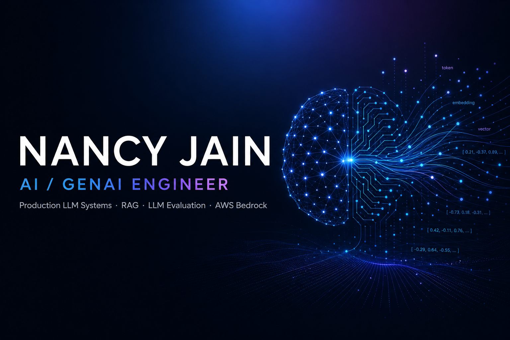

  

<h3 align="center">Nancy Jain · AI / GenAI Engineer</h3>

<b>I build production LLM & agentic AI systems that ship.</b>

  RAG · LLM evaluation · agentic workflows · multimodal scoring · AWS Bedrock 
  2+ years turning large language models into reliable, real-world products.

  
  
  
  

---

### Proof of work

| | |
| :--- | :--- |
| **2+ yrs** | Production AI engineering across LLM classification, RAG, evaluation & agentic systems |
| **20M+** | Product records classified via embeddings → Qdrant → Bedrock pipeline |
| **80 → 97%** | Tagging accuracy improvement on Meta Mapper (verified holdout eval) |
| **5 tools** | MCP server + Slack agent for citation-grounded doc Q&A (LiteLLM) |
| **Live** | RAG assistant deployed on Execute Community platform |

---

### What I build

**LLM systems at scale**
Queue-based microservices (FastAPI · SQS · S3 · Kubernetes) that classify millions of product records via retrieval-augmented LLM pipelines.

**Agentic AI & tool use**
MCP servers with multi-tool orchestration — built an internal **semantics_info** agent (5 MCP tools + Slack bot) for citation-grounded Q&A over service docs via LiteLLM.

**LLM evaluation & quality**
LLM-as-judge services auditing 4 tagging domains with pass/fail/not-sure verdicts, async batch jobs, and config-driven validation.

**Multimodal & resilient backends**
Image/text scoring with multimodal Claude; hardened Bedrock inference (STS refresh, backoff retries, streaming batch processing).

---

### Core stack

  
  
  
  
  
  
  
  

<i>RAG · Agentic AI · MCP · Tool Calling · LLM Evaluation · Prompt Engineering · Semantic Search · Multimodal LLMs · LiteLLM</i>

---

### Featured work

| Project | What it does | Link |
| :--- | :--- | :---: |
| **Execute Community (EXCOM)** | RAG AI assistant — summarize, suggest topics, answer queries. Live in production. | [App ↗](https://www.executepartners.com/Community) · [Code](https://github.com/nancyjain779/Execute_AI) |
| **Meta Mapper** | 7+ microservice LLM taxonomy platform — 20M+ records, 80→97% accuracy | NDA |
| **semantics_info MCP Agent** | 5-tool MCP server + Slack bot for citation-grounded doc Q&A | NDA |
| **Portfolio** | Selected work, experience, résumé | [Site ↗](https://nancyjain779.github.io/) |

---

### Reach me

Open to **AI Engineer · GenAI Engineer · Agentic AI Engineer · Applied AI Engineer** roles.

📧 [jainnancy779@gmail.com](mailto:jainnancy779@gmail.com) · 🔗 [LinkedIn](https://www.linkedin.com/in/nancyjain779/) · 🌐 [Portfolio](https://nancyjain779.github.io/) · 💻 [GitHub](https://github.com/nancyjain779)
